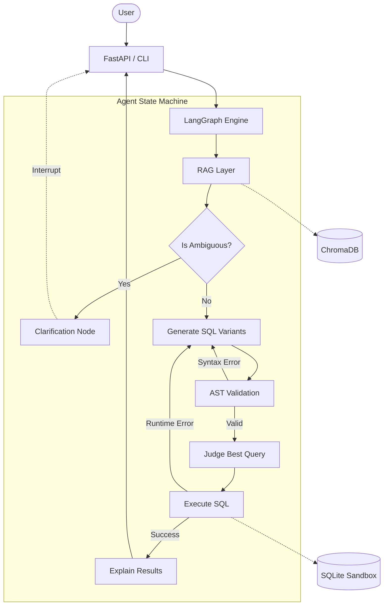

# SQLPilot 🚀

SQLPilot is a production-grade **Agentic RAG pipeline** that translates natural language questions into highly accurate, secure, and optimized SQL queries. It is designed to act as an autonomous Data Analyst, answering complex business questions by querying databases directly.

Built entirely in Python, SQLPilot uses a **LangGraph state machine** to orchestrate an advanced reasoning loop that includes Ambiguity Detection, AST Security Validation, Self-Consistency (Chain-of-Thought), and Human-in-the-Loop approvals.

---

## 🏗️ Architecture



*(Note: You can place your custom architecture diagram screenshot at `docs/architecture.png`)*

---

## 📊 Project Status

| Phase | Name | Status |
|---|---|---|
| 0 | Foundation | 🟢 Done |
| 1 | Core Pipeline | 🟢 Done |
| 2 | RAG Layer | 🟢 Done |
| 3 | Clarification Engine | 🟢 Done |
| 4 | AST Validation & Blocklist | 🟢 Done |
| 5 | Self-Consistency (Majority Voting) | 🟢 Done |
| 6 | Few-Shot Golden Examples | 🟢 Done |
| 7 | Observability (Langfuse) | 🟢 Done |
| 8 | Advanced Memory (User Rules) | 🟢 Done |
| 9 | Production API (FastAPI) | 🟢 Done |
| 10 | Security Sandbox (Read-Only Mode) | 🟢 Done |
| 11 | Streamlit UI | 🟡 Pending (V2 Plan) |
| 12 | Test & Eval Suite | 🟡 Pending (V2 Plan) |

---

## 🛠️ Tech Stack

* **Frameworks:** Python, LangGraph, LangChain, FastAPI, Uvicorn
* **AI & LLM:** Google Gemini 3.5 Flash
* **Retrieval (RAG):** ChromaDB, HuggingFace (`all-MiniLM-L6-v2`)
* **Security:** SQLGlot (AST parsing), SQLite Read-Only Sandbox
* **Observability:** Langfuse

---

## 🚀 Getting Started

### 1. Installation

Clone the repository and install the dependencies in a virtual environment:

```bash
python -m venv venv
# Windows:
.\venv\Scripts\activate
# Mac/Linux:
source venv/bin/activate

pip install -r requirements.txt
```

### 2. Environment Variables

Create a `.env` file in the root directory and add your API keys:

```env
# Google Gemini API
GEMINI_API_KEY=your_gemini_api_key_here

# Langfuse Telemetry (Optional)
LANGFUSE_PUBLIC_KEY=pk-lf-...
LANGFUSE_SECRET_KEY=sk-lf-...
LANGFUSE_HOST=https://cloud.langfuse.com
```

### 3. Initialize the Database & RAG Index

Seed the dummy SQLite database and build the local ChromaDB vector index:

```bash
python scripts/seed_database.py
python scripts/index_rag.py
```

### 4. Run the Application

You can interact with SQLPilot either through the interactive terminal CLI or by starting the FastAPI production server.

**Option A: Interactive CLI**
```bash
python -m app.cli
```
*Tip: Try typing `/remember Always format dates as YYYY-MM-DD` in the CLI to test the persistent memory engine!*

**Option B: FastAPI Server**
```bash
python -m uvicorn app.api:app --reload
```
Open your browser and navigate to **http://localhost:8000/docs** to interact with the Swagger UI.

---

## 🛡️ Security

This project employs a strict defense-in-depth approach to database access:
1. **AST Blocklist**: `SQLGlot` parses generated queries into an Abstract Syntax Tree (AST) and rigorously rejects `UPDATE`, `INSERT`, `DELETE`, `DROP`, and `ALTER`.
2. **Database Sandbox**: The `DatabaseExecutor` explicitly sets `PRAGMA query_only = ON;` before executing any statement, ensuring the underlying database engine cannot mutate data even if an exploit bypasses the Python layer.

---

## 📁 Project Structure

```
app/
  agent/          LangGraph state machine (nodes, edges, prompt logic)
  db/             SQLite connector (read-only execution)
  llm/            LLM client wrapper (Gemini + LangChain)
  rag/            ChromaDB retriever
  cli.py          Interactive CLI entry point
  api.py          FastAPI production server
scripts/          Database seeding and RAG indexing scripts
data/             SQLite database file and persistent JSON memory
README.md         Project overview and architecture
```
