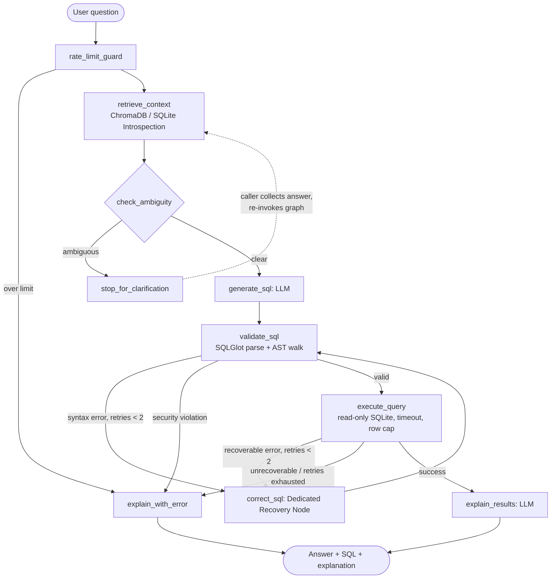

# 🚀 SQLPilot (v2.0)

A production-ready Text-to-SQL agent that **asks before it guesses**. Built with LangGraph, FastAPI, Streamlit, SQLGlot, and ChromaDB.

Ask a question in plain English, and SQLPilot retrieves the right schema, checks whether your question is actually answerable without guessing, generates dialect-aware SQL, validates and self-corrects it before it ever touches the database, runs it in a locked-down read-only sandbox, and explains the result back to you in plain English.

---

## 📑 Table of Contents
- [Why This Exists (The Challenges Solved)](#-why-this-exists-the-challenges-solved)
- [Architecture & State Graph](#-architecture--state-graph)
- [Dataset & Multi-Page UI](#-dataset--multi-page-ui)
- [Validation & Self-Correction](#-validation--self-correction)
- [Security & Sandbox](#-security--sandbox)
- [Live Demo & Deployment](#-live-demo--deployment)
- [Local Development](#-local-development)

---

## 💡 Why This Exists (The Challenges Solved)

Building a text-to-SQL system that humans can actually trust is hard. Naive "prompt-in, query-out" scripts fail for predictable reasons. Here is how SQLPilot v2.0 solves them:

### 1. The Hallucination Problem (Invented Columns)
* **Challenge:** LLMs guess column names from training data (e.g. generating `first_name` when the table only has `full_name`).
* **Solution:** SQLPilot uses a **ChromaDB RAG** system to fetch semantic schema data. For cloud deployments with strict memory limits (like Render's free tier), it automatically falls back to a robust **Direct Introspection Fallback** using `sqlite_master` to ensure 100% uptime.

### 2. The Domain Knowledge Gap (Ambiguity)
* **Challenge:** "Show me top people" means nothing to an LLM without knowing if you mean employees or customers.
* **Solution:** An ambiguity-detection node classifies the question *before* any SQL is generated. If it is genuinely ambiguous, the pipeline halts and asks a clarifying question (**Human-in-the-Loop**) instead of silently picking an interpretation.

### 3. Syntax & Dialect Errors
* **Challenge:** LLMs mix up dialect-specific syntax and occasionally produce SQL that just doesn't parse.
* **Solution:** Generated SQL is parsed with **SQLGlot** before it ever reaches the database. A parse failure is fed back to the LLM along with the exact error and prior failed attempts, looping through a self-correction node.

### 4. Database Security Risks
* **Challenge:** Prompt injection or a model mistake could produce a `DROP TABLE` or similar.
* **Solution:** (1) An AST walk over the parsed SQLGlot tree mathematically verifies no mutation node types exist, even if hidden in a subquery. (2) A Sliding-Window rate limiter protects the API.

---

## 🏗️ Architecture & State Graph

The core of the system is a **LangGraph state machine**. A single typed `AgentState` flows through a series of nodes with conditional routing — including two independent retry loops and an early-exit path for ambiguous questions.



### System Components

| Layer | Technology | Role |
|---|---|---|
| **Orchestrator** | LangGraph | Deterministic state machine with two retry loops and a clarification exit. Also supports `is_eval_mode` for automated BIRD-bench testing. |
| **LLM** | Groq (Qwen API) | Fast, intelligent SQL generation and ambiguity detection. |
| **Context Engine**| ChromaDB + Introspection | Retrieves schema chunks semantically or directly via dynamic SQLite fallback. |
| **Validation** | SQLGlot | Offline parse + AST mutation scan, dialect-aware. |
| **Database** | SQLite (Chinook) | Read-only connection, 5s timeout, 100-row cap. |
| **API & UI** | FastAPI + Streamlit | Secure REST backend powering a multi-page interactive frontend. |

---

## 🗄️ Dataset & Multi-Page UI

### The Chinook Database
To prove SQLPilot can navigate complex, normalized enterprise data, the agent runs against the industry-standard **Chinook Database**. 
* **Scale:** 11 Tables, ~15,000 rows.
* **Complexity:** Requires the AI to autonomously write complex 4-table JOINs with mathematical aggregations (e.g., `Artist` -> `Album` -> `Track` -> `InvoiceLine`).

### Streamlit Multi-Page Interface
The frontend has been completely revamped into a sleek, multi-page web application featuring:
1. **💬 Chat Interface:** Real-time conversational UI that handles asynchronous Human-in-the-Loop interruptions.
2. **🗄️ Database Schema Explorer:** A dynamic, Pandas-driven schema inspector that actively renders the connected database's tables, columns, and primary keys.
3. **ℹ️ About SQLPilot:** Project documentation and test-case suggestions.

---

## 🛠️ Validation & Self-Correction

SQLPilot features a **Dedicated Recovery Node**. If an Execution Error occurs (e.g. `SQLite error: no such table: customers`), the LangGraph state machine catches the error, records it in the `correction_history` array, and routes it to the `correct_sql` node. 

The LLM is prompted with the entire history of its failed attempts and the exact error messages so it can learn from its mistakes and generate a newly corrected variant. 

---

## 🛡️ Security & Sandbox

We take security seriously. SQLPilot deploys a zero-trust defense-in-depth approach:
1. **Prompt Engineering Sandbox:** The LLM refuses to write DDL/DML.
2. **AST Walk:** We parse the raw string into a SQLGlot Abstract Syntax Tree and mathematically verify no `DROP`, `DELETE`, `INSERT`, `UPDATE`, `ALTER`, or `COMMAND` nodes exist.
3. **Execution Sandbox:** The SQLite connection is heavily restricted to a 5-second `threading.Timer` execution window and a 100-row `fetchmany()` limit to prevent Denial of Service via massive queries.

---

## 🌐 Live Demo & Deployment

**Check out the live deployment here:**  
🔗 **[https://sqlpilot-z317.onrender.com](https://sqlpilot-z317.onrender.com)** *(Streamlit UI)*

### Deploying to Render
This repository is heavily optimized for Render's Free Tier (hence the memory-conscious schema introspection fallback).
1. **Backend (`sqlpilot-api`):** Deploy a new Web Service using the `render.yaml` configuration. Set `GROQ_API_KEY` and `GEMINI_API_KEY` in the environment settings.
2. **Frontend (`sqlpilot-ui`):** Deploy another Web Service for the Streamlit UI. Set `SQLPILOT_API_URL` to point to your backend.

---

## 💻 Local Development

```bash
git clone https://github.com/bhandari16arjun/SqlPilot.git
cd SqlPilot
python -m venv venv
source venv/bin/activate  # (On Windows: .\venv\Scripts\activate)
pip install -r requirements.txt
```

Create a `.env` file:
```env
GROQ_API_KEY=your_groq_api_key_here
GEMINI_API_KEY=your_google_ai_studio_api_key_here
SQLPILOT_API_URL=http://localhost:10000
DATABASE_URL=sqlite:///data/demo.db
```

Seed the Chinook database and run the backend locally:
```bash
python scripts/seed_database.py
uvicorn app.api:app --host 0.0.0.0 --port 10000
```

In a new terminal window, start the Streamlit UI:
```bash
streamlit run streamlit_app.py --server.port 8501
```
